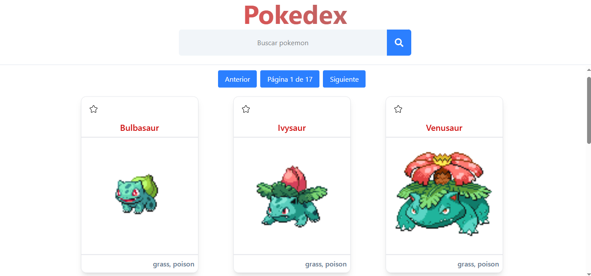

# 🧿 Pokedex

Una Pokedex construida con **React**, usando **Redux Toolkit**, **Vite**, y **TailwindCSS**. Consume la [PokéAPI](https://pokeapi.co/) para listar pokémon, permite buscarlos por nombre y aplicar paginación en el lado del cliente.

---
## 🧑‍💻 Autor
Desarrollado por Oscar Vallecillo — abierto a contribuciones, ideas o feedback.

## 📸 Vista previa


## ⚙️ Tecnologías utilizadas

- ⚛️ **React 18**
- 🚀 **Vite** — configuración ultrarrápida para desarrollo
- 🎯 **Redux Toolkit** — manejo de estado moderno
- 🧭 **React Router v6.30**
- 💨 **TailwindCSS 4**
- 🎨 **CSS puro**
- 🧱 **Composición de componentes**
- 📦 **pnpm**

---

## 🚀 Instalación y uso

## 1. Clona el repositorio:

```bash
git clone https://github.com/tu-usuario/pokedux.git
cd pokedux
```

## 2. Instala las dependencias con pnpm:

```bash
pnpm install
```

## 3. Ejecuta el servidor de desarrollo:

```bash
pnpm run dev
```

## 4. 🧠 Estructura del proyecto
```bash
src/
├── api/              # Funciones para consumir la PokéAPI
├── components/       # Componentes reutilizables y composables
├── hooks/            # Custom hooks (ej: usePagination)
├── middlewares/      # Para la transformacion y carga de los datos
├── reducers/         # Root reducer
├── slices/           # Slices de Redux Toolkit (estado global)
├── router.jsx        # Configuración de rutas
├── App.jsx           # Componente principal
└── main.jsx          # Entrada de la app
```
# 5. ✨ Funcionalidades

- ✅ Listado completo de Pokémon (151 primeros)

- 🔍 Búsqueda por nombre en tiempo real

- 📄 Paginación en el lado del cliente (cliente-side)

- ❤️ Marcar Pokémon como favoritos

- 🌀 Carga de datos con loading spinner

- 🔧 Código organizado y fácil de mantener

# 6. 🔧 Scripts disponibles

```bash
pnpm run dev       # Servidor de desarrollo
pnpm run build     # Construye la app para producción
pnpm run preview   # Sirve la versión de producción

```

## 7. 💡 Notas adicionales

- Este proyecto aplica composición de componentes, por ejemplo, con CardPokemon, que usa subcomponentes como CardHeader, CardBody, CardFooter, etc.

- Todo el manejo de estado global se hace con Redux Toolkit.

- Se utiliza TailwindCSS junto con algunas reglas de CSS puro para animaciones o estilos más específicos.